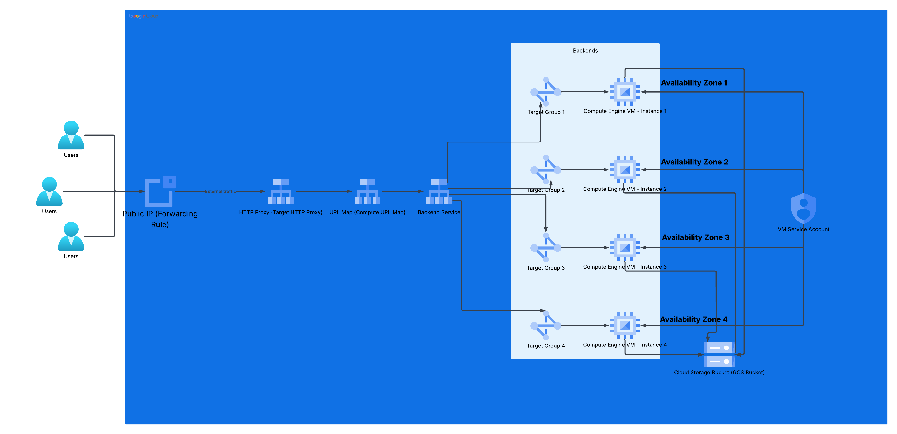

<div align="center">

# 🌀 GCP Runtime Domain Load Balancer with React, Terraform, Private Compute, and Cloud Storage

**Production-inspired GCP infrastructure project with Terraform, private Compute Engine VMs, Cloud NAT, Cloud Storage artifacts, Nginx startup automation, and a global HTTP Load Balancer**

<br/>



<br/>
<br/>


</div>

---

## 📋 Table of Contents

- [📌 Overview](#-overview)
- [🧠 Problem Statement](#-problem-statement)
- [🎯 Project Objective](#-project-objective)
- [🏗️ Architecture Diagram](#️-architecture-diagram)
- [🔄 Architecture Flow](#-architecture-flow)
- [🎬 Demo](#-demo)
- [🧰 Technology Stack](#-technology-stack)
- [✨ What This Project Demonstrates](#-what-this-project-demonstrates)
- [✅ What This Builds](#-what-this-builds)
- [🧱 Core GCP Resources](#-core-gcp-resources)
- [📁 Project Structure](#-project-structure)
- [📦 Required Download to Run the Project](#-required-download-to-run-the-project)
- [🚀 Quick Start](#-quick-start)
- [🧪 Validation & Testing](#-validation--testing)
- [🔐 Security Architecture](#-security-architecture)
- [📊 Observability](#-observability)
- [🔁 CI/CD Pipeline Simulation](#-cicd-pipeline-simulation)
- [⚖️ Scaling Considerations](#️-scaling-considerations)
- [🧩 Multi-Service Expansion](#-multi-service-expansion)
- [🧹 Teardown](#-teardown)
- [🧠 Lessons Learned](#-lessons-learned)
- [🧪 Troubleshooting](#-troubleshooting)
- [📚 References](#-references)
- [🚀 Why This Project Matters](#-why-this-project-matters)
- [✨ What This Project Proves](#-what-this-project-proves)
- [👨‍💻 About the Author](#-about-the-author)

---

## 📌 Overview

This project deploys a custom React frontend across private Google Compute Engine servers using Terraform, Cloud Storage artifacts, Nginx startup automation, Cloud NAT, and a global HTTP Load Balancer.

The frontend includes four runtime character experiences:

- Gojo Satoru
- Ryomen Sukuna
- Yuta Okkotsu
- Hiromi Higuruma

The visual layer is anime-inspired, but the engineering focus is cloud infrastructure. This repository demonstrates how a static frontend can be packaged, uploaded as a deployable artifact, pulled into private compute instances at boot time, served through Nginx, and exposed through a managed GCP load balancing stack.

A production-inspired GCP infrastructure project that deploys a custom React frontend across private Compute Engine servers using Terraform, Cloud Storage artifacts, Nginx startup automation, Cloud NAT, and a global HTTP Load Balancer. The project demonstrates artifact-based deployment, private VM hosting, runtime metadata generation, backend service routing, and repeatable infrastructure provisioning on Google Cloud.

---

## 🧠 Problem Statement

A frontend project becomes more valuable when it is deployed through real infrastructure patterns instead of being hosted only as a local build or simple static site.

This project addresses several practical cloud engineering problems:

- How do private VMs download deployment artifacts without public IP addresses?
- How can Terraform provision repeatable networking, compute, IAM, and load balancing resources?
- How can a startup script turn a generic VM into a configured Nginx web server?
- How can each server expose runtime metadata to prove which backend served the request?
- How can a frontend build be kept out of the source tree when the packaged artifact is too large or inconvenient to commit directly?
- How does a GCP HTTP Load Balancer actually route traffic to backend services and instance groups?

---

## 🎯 Project Objective

The objective is to build a realistic GCP infrastructure deployment that proves the following:

- A React application can be packaged into a deployment artifact.
- The artifact can be stored in Cloud Storage outside the normal source tree.
- Private Compute Engine VMs can download artifacts through Cloud NAT.
- Terraform can provision the network, compute, IAM, and load balancing layers.
- Nginx can serve the extracted frontend build from each VM.
- Runtime JSON files can expose server-specific metadata.
- A global HTTP Load Balancer can route users to backend services backed by unmanaged instance groups.

---

## 🏗️ Architecture Diagram


Save your architecture image as:

```text
diagrams/architecture-diagram.png
```

The architecture diagram should show:

- External user
- Public IP / global forwarding rule
- Target HTTP proxy
- URL map
- Backend services
- Instance groups
- Four private Compute Engine VMs across zones
- VM service account
- Cloud Storage artifact bucket outside the zones
- VPC boundary
- Private subnets
- Cloud NAT and Cloud Router
- Nginx on each VM
- React app served from each VM

> Important GCP terminology: use **Instance Group**, not target group. Target group is AWS language. Cloud Storage should not be placed inside an availability zone because it is not a zonal resource.

---

## 🔄 Architecture Flow

### User Traffic Flow

```text
User Browser
     ↓
Global Forwarding Rule / Public IP
     ↓
Target HTTP Proxy
     ↓
URL Map
     ↓
Backend Service
     ↓
Unmanaged Instance Group
     ↓
Private Compute Engine VM
     ↓
Nginx
     ↓
React Static Site
```

### Artifact Deployment Flow

```text
site-build.tar.gz
     ↓
build-upload-site.sh
     ↓
Google Cloud Storage Bucket
     ↓
VM Startup Script
     ↓
Download + Extract
     ↓
Nginx Web Root
     ↓
React Site Served
```

### Private VM Outbound Flow

```text
Private Compute Engine VM
     ↓
Cloud NAT
     ↓
Google Cloud Storage / package repositories
```

### IAM Access Flow

```text
VM Service Account
     ↓
roles/storage.objectViewer
     ↓
Cloud Storage Artifact Bucket
```

### GCP Load Balancer Mental Model

In GCP, a load balancer is not one Terraform resource. It is built from multiple connected resources:

```text
Global Forwarding Rule
     ↓
Target HTTP Proxy
     ↓
URL Map
     ↓
Backend Service
     ↓
Instance Group
     ↓
VM
```

AWS comparison:

```text
AWS ALB Listener      ≈ GCP Forwarding Rule + Target Proxy
AWS Listener Rules    ≈ GCP URL Map
AWS Target Group      ≈ GCP Backend Service
AWS EC2 Targets       ≈ GCP Instance Group + VM
```

### URL Map Routing

A GCP URL map is the load balancer routing table.

It decides:

```text
When the user goes to this path, send them to this backend.
```

Example:

```text
/gojo     → Gojo backend
/sukuna   → Sukuna backend
/yuta     → Yuta backend
/higuruma → Higuruma backend
```

The default service is used when no path rule matches.

```text
If no path rule matches, send the user here.
```

### Backend Routing Options

There are two common routing patterns for this project.

#### Option A — Path-Based Backend Services

```text
/gojo     → Gojo backend     → Gojo instance group     → Gojo VM
/sukuna   → Sukuna backend   → Sukuna instance group   → Sukuna VM
/yuta     → Yuta backend     → Yuta instance group     → Yuta VM
/higuruma → Higuruma backend → Higuruma instance group → Higuruma VM
```

With this pattern, refreshing the page does not rotate between servers. The same path consistently maps to the same backend.

#### Option B — Shared Backend Service

```text
/ → all characters backend
    ├── Gojo instance group
    ├── Sukuna instance group
    ├── Yuta instance group
    └── Higuruma instance group
```

This pattern can distribute requests across all backend instance groups. However, GCP does not guarantee strict round-robin behavior on every browser refresh. If testing load balancing behavior, remove session affinity.

---

## 🎬 Demo

Demo Video:  
`<add-demo-video-link-here>`

---

## 🧰 Technology Stack

<p align="center">
  
  
  
  
  
  
  
  
  
  
</p>

| Layer | Technology |
|---|---|
| Cloud Provider | Google Cloud Platform |
| Infrastructure as Code | Terraform |
| Frontend | React, Vite, JavaScript, CSS |
| Web Server | Nginx |
| Compute | Private Compute Engine VMs |
| Networking | Custom VPC, public/private subnets, firewall rules |
| Private Egress | Cloud NAT and Cloud Router |
| Artifact Storage | Google Cloud Storage |
| Load Balancing | Global HTTP Load Balancer, target HTTP proxy, URL map, backend services |
| Runtime Automation | Compute Engine startup script template |
| Deployment Scripts | Bash and `gcloud` CLI |

---

## ✨ What This Project Demonstrates

- GCP networking design with custom VPC and subnets
- Private compute deployment without public VM exposure
- Artifact-based frontend deployment using Cloud Storage
- Cloud NAT-based outbound access for private servers
- Terraform-managed infrastructure provisioning
- Startup script automation with `templatefile`
- Nginx configuration and static site hosting
- Runtime metadata generation using JSON files
- GCP load balancer routing with forwarding rules, target proxies, URL maps, backend services, and instance groups
- IAM scoping with a dedicated VM service account and bucket-level object viewer access

---

## ✅ What This Builds

- A custom GCP VPC
- Two public subnets
- Two private subnets
- Cloud Router
- Cloud NAT
- Dedicated Compute Engine service account
- Cloud Storage artifact bucket permissions
- Four private Compute Engine web servers
- Nginx runtime configuration on each server
- React static frontend deployment from `site-build.tar.gz`
- Runtime `site-config.json`
- Runtime `server-metadata.json`
- Unmanaged instance groups
- Backend services
- Health check
- URL map
- Target HTTP proxy
- Global forwarding rule
- Public load balancer endpoint

---

## 🧱 Core GCP Resources

| GCP Resource | Role in Architecture |
|---|---|
| **Custom VPC** | Provides the isolated network boundary for the project. |
| **Public Subnets** | Support public-facing load balancer-related networking patterns. |
| **Private Subnets** | Host Compute Engine VMs without direct public exposure. |
| **Cloud Router** | Required for Cloud NAT configuration. It is not a route table. |
| **Cloud NAT** | Allows private VMs to reach package repositories and Cloud Storage without public IPs. |
| **Compute Engine** | Runs private Nginx web servers that host the React static build. |
| **Service Account** | Provides the VM identity used to access the artifact bucket. |
| **Cloud Storage** | Stores the compressed site artifact used during VM startup. |
| **Cloud Storage IAM** | Grants the VM service account `roles/storage.objectViewer` on the artifact bucket. |
| **Unmanaged Instance Groups** | Attach individual VMs to GCP backend services. |
| **Backend Services** | Connect the load balancer to instance groups. |
| **Health Check** | Verifies backend availability on port 80. |
| **URL Map** | Routes incoming paths to the correct backend service. |
| **Target HTTP Proxy** | Receives HTTP traffic and connects it to the URL map. |
| **Global Forwarding Rule** | Exposes the public IP and forwards traffic into the load balancer. |

---

## 📁 Project Structure

Development project structure:

```text
WEEK 1 TO ME/
├── README.md
├── site-build.tar.gz
├── startup-script.sh.tpl
├── 1-network.tf
├── 2-instances.tf
├── 3-load_balancer.tf
├── 4-variable.tf
├── 5-output.tf
├── scripts/
│   ├── build-upload-site.sh
│   └── destroy-artifact-bucket.sh
├── jjk-domain-sites/
│   ├── package.json
│   ├── package-lock.json
│   ├── vite.config.js
│   ├── index.html
│   ├── public/
│   │   ├── images/
│   │   └── videos/
│   └── src/
│       ├── App.jsx
│       ├── index.css
│       └── main.jsx
└── diagrams/
    └── architecture-diagram.png
```

This is the development structure used while building and deploying locally.

| Path | Purpose |
|---|---|
| `1-network.tf` | Defines the custom VPC, subnets, Cloud Router, Cloud NAT, and networking resources. |
| `2-instances.tf` | Defines Compute Engine VMs, service account usage, startup script configuration, and instance groups. |
| `3-load_balancer.tf` | Defines health checks, backend services, URL map, HTTP proxy, and forwarding rule. |
| `4-variable.tf` | Stores configurable Terraform variables such as project ID, region, bucket name, and site settings. |
| `5-output.tf` | Outputs useful deployment values such as the site URL or load balancer IP. |
| `startup-script.sh.tpl` | Startup script template used to configure Nginx and deploy the React build on each VM. |
| `scripts/build-upload-site.sh` | Uploads `site-build.tar.gz` to the Cloud Storage artifact bucket. |
| `scripts/destroy-artifact-bucket.sh` | Deletes the artifact bucket and objects after teardown. |
| `jjk-domain-sites/` | React/Vite frontend source code. |
| `diagrams/` | Stores the exported architecture diagram. |

---

## 📦 Required Download to Run the Project

This project requires an additional large file that is not included directly in the repository because it contains the packaged website build and assets.

Required file:

```text
site-build.tar.gz
```

After cloning the repository, download the large project asset from the repository release page and move it into the project root.

Expected location:

```text
<project-root>/site-build.tar.gz
```

Expected placement:

```text
<project-root>/
├── site-build.tar.gz
├── scripts/
├── jjk-domain-sites/
├── 1-network.tf
├── 2-instances.tf
├── 3-load_balancer.tf
├── 4-variable.tf
├── 5-output.tf
└── startup-script.sh.tpl
```

Validate that the file exists before running the upload script:

```bash
ls -lh site-build.tar.gz
```

The upload script expects the compressed site artifact one level above the `scripts/` directory:

```text
../site-build.tar.gz
```

---

## 🚀 Quick Start

### 1. Clone the Repository

```bash
git clone <your-repo-url>
cd <project-root>
```

### 2. Download the Required Site Artifact

Download the required large file from the repository release page:

```text
site-build.tar.gz
```

Move it into the root of the project:

```text
<project-root>/site-build.tar.gz
```

Validate placement:

```bash
ls -lh site-build.tar.gz
```

### 3. Change the GCP Project ID in Terraform

Open:

```text
4-variable.tf
```

Look for:

```hcl
project_id = "gcp-mastery-495919"
```

Change it to your own GCP project ID:

```hcl
project_id = "YOUR_GCP_PROJECT_ID"
```

### 4. Change the GCP Project ID in Both Scripts

Open:

```text
scripts/build-upload-site.sh
scripts/destroy-artifact-bucket.sh
```

Look for:

```bash
PROJECT_ID="gcp-mastery-495919"
```

Change it to:

```bash
PROJECT_ID="YOUR_GCP_PROJECT_ID"
```

Also update the bucket name if needed:

```bash
BUCKET_NAME="YOUR_GCP_PROJECT_ID-jjk-domain-site-artifacts"
```

The bucket name in the scripts should match the Terraform variable used for the artifact bucket.

### 5. Authenticate to Google Cloud

```bash
gcloud auth login
gcloud auth application-default login
gcloud config set project YOUR_GCP_PROJECT_ID
```

### 6. Upload the Site Artifact to Cloud Storage

Run the upload script from inside the `scripts/` folder:

```bash
cd scripts
chmod +x build-upload-site.sh
./build-upload-site.sh
```

The script uploads the artifact to:

```text
gs://<bucket-name>/site-builds/site-build.tar.gz
```

### 7. Deploy the Terraform Infrastructure

Return to the project root:

```bash
cd ..
```

Initialize and deploy:

```bash
terraform init
terraform fmt
terraform validate
terraform plan
terraform apply
```

### 8. Open the Load Balancer URL

```bash
terraform output site_url
```

Open the returned URL in a browser.

---

## 🧪 Validation & Testing

### Validate Terraform Outputs

```bash
terraform output
```

Confirm that Terraform returns the load balancer URL, IP address, or any configured output values.

### Validate Compute Instances

```bash
gcloud compute instances list
```

Expected private web servers:

```text
jjk-gojo-web
jjk-sukuna-web
jjk-yuta-web
jjk-higuruma-web
```

### Validate Backend Health

```bash
gcloud compute backend-services get-health <backend-service-name> --global
```

Expected result:

```text
HEALTHY
```

### Validate Runtime Metadata from the Load Balancer

```bash
curl http://<LOAD_BALANCER_IP>/server-metadata.json
```

Expected metadata fields:

```text
ProjectId
InstanceName
MachineType
Region
Zone
InternalIP
DefaultCharacter
DeployedAt
```

### Validate Local VM Runtime

SSH into a VM if needed, then run:

```bash
sudo systemctl status nginx
sudo nginx -t
ls -lah /var/www/jjk-domain-sites
curl http://localhost/server-metadata.json
```

---

## 🔐 Security Architecture

| Layer | Security Control |
|---|---|
| Network | Private Compute Engine VMs are not directly exposed to the internet. |
| Egress | Cloud NAT allows outbound access for private VMs. |
| Identity | Compute Engine uses a dedicated service account. |
| Storage | Cloud Storage bucket uses uniform bucket-level access. |
| Access Control | VM service account receives only object viewer access to the artifact bucket. |
| Load Balancing | Public access enters through the HTTP Load Balancer instead of directly hitting VMs. |
| Runtime Config | Server metadata is generated dynamically instead of hardcoded. |

### Security Design Notes

- The VMs are private and do not require public IP addresses for artifact download.
- The artifact bucket is read by the VM service account using least-privilege access.
- Public traffic terminates at the GCP HTTP Load Balancer.
- Backend access is controlled through GCP load balancing and firewall rules.
- The deployment artifact is separated from source code and pulled during bootstrapping.
- Runtime metadata is generated dynamically, which helps prove backend identity during testing.

### Bucket Access Pattern

Because the artifact bucket is created by the script, Terraform should read it as an existing bucket:

```hcl
variable "site_bucket_name" {
  description = "Existing GCS bucket that stores the site artifact"
  type        = string
  default     = "gcp-mastery-495919-jjk-domain-site-artifacts"
}

data "google_storage_bucket" "site_artifacts" {
  name = var.site_bucket_name
}

resource "google_storage_bucket_iam_member" "site_artifacts_viewer" {
  bucket = data.google_storage_bucket.site_artifacts.name
  role   = "roles/storage.objectViewer"
  member = "serviceAccount:${google_service_account.web.email}"
}
```

Then pass the bucket name into the startup script:

```hcl
site_bucket = data.google_storage_bucket.site_artifacts.name
```

---

## 📊 Observability

This project keeps observability simple but practical.

The main runtime visibility feature is:

```text
/server-metadata.json
```

That endpoint helps confirm which server handled a request and what runtime configuration was generated during deployment.

Useful VM-level checks:

```bash
sudo systemctl status nginx
sudo nginx -t
sudo tail -100 /var/log/syslog
ls -lah /var/www/jjk-domain-sites
curl http://localhost/server-metadata.json
```

Useful load balancer checks:

```bash
gcloud compute backend-services get-health <backend-service-name> --global
curl http://<LOAD_BALANCER_IP>/server-metadata.json
```

### Runtime Metadata Example

```json
{
  "Platform": "Google Cloud Platform",
  "Service": "Compute Engine VM",
  "ProjectId": "project-id",
  "InstanceName": "instance-name",
  "InstanceId": "instance-id",
  "MachineType": "machine-type",
  "Region": "us-central1",
  "Zone": "us-central1-a",
  "InternalIP": "internal-ip",
  "WebServer": "Nginx",
  "BuildType": "React Static Build",
  "ArtifactBucket": "bucket-name",
  "ArtifactObject": "site-builds/site-build.tar.gz",
  "DefaultCharacter": "gojo",
  "DeployedAt": "timestamp"
}
```

---

## 🔁 CI/CD Pipeline Simulation

This project does not require a full CI/CD platform to demonstrate the deployment flow. The current local workflow simulates a basic artifact-based pipeline:

```text
Build React frontend
     ↓
Package as site-build.tar.gz
     ↓
Upload artifact to Cloud Storage
     ↓
Terraform provisions infrastructure
     ↓
Startup scripts pull artifact at boot
     ↓
Nginx serves the deployed site
```

A production pipeline could use GitHub Actions, GitLab CI, Jenkins, or Cloud Build to automate:

- frontend build
- artifact compression
- upload to Cloud Storage
- `terraform fmt`
- `terraform validate`
- `terraform plan`
- manual approval before `terraform apply`
- deployment output capture
- post-deployment health checks

Example pipeline stages:

```text
Validate
  └── terraform fmt
  └── terraform validate

Build
  └── npm install
  └── npm run build
  └── tar -czf site-build.tar.gz dist/

Upload
  └── gcloud storage cp site-build.tar.gz gs://<bucket>/site-builds/site-build.tar.gz

Deploy
  └── terraform plan
  └── terraform apply

Verify
  └── curl http://<LOAD_BALANCER_IP>/server-metadata.json
```

---

## ⚖️ Scaling Considerations

| Area | Current Design | Production Improvement |
|---|---|---|
| Compute | Four private VMs | Use managed instance groups for autoscaling and self-healing. |
| Load Balancing | Global HTTP Load Balancer | Add HTTPS with managed certificates and a custom domain. |
| Artifact Delivery | Startup script pulls from Cloud Storage | Add versioned artifacts and deployment rollbacks. |
| Runtime Config | JSON files generated during boot | Add structured config versioning and deployment metadata. |
| Availability | Multiple VMs across zones | Add health-aware autoscaling and multi-region failover. |
| Security | Private VMs and least-privilege bucket read | Add OS Login, IAP, Cloud Armor, and tighter firewall policies. |
| Observability | Runtime metadata and basic health checks | Add Cloud Logging dashboards, uptime checks, and alerting. |
| CI/CD | Manual script and Terraform workflow | Add Cloud Build, GitHub Actions, or GitLab CI with approval gates. |

---

## 🧩 Multi-Service Expansion

This project can evolve into a larger cloud platform pattern.

Possible expansion paths:

- Add Cloud Armor in front of the load balancer for Layer 7 protection.
- Add HTTPS with a managed certificate and custom domain.
- Convert unmanaged instance groups to managed instance groups.
- Add autoscaling based on CPU utilization or request load.
- Add Cloud Logging dashboards for Nginx and startup script activity.
- Add deployment versioning in Cloud Storage.
- Add a blue/green deployment pattern using separate backend services.
- Add Cloud Build for artifact packaging and deployment.
- Add an API backend behind a separate URL map path.
- Add private database connectivity for a full multi-tier application.
- Add centralized runtime inventory by collecting `server-metadata.json` output from each VM.

---

## 🧹 Teardown

Destroy the Terraform-managed infrastructure:

```bash
terraform destroy
```

Then delete the Cloud Storage artifact bucket and objects:

```bash
cd scripts
chmod +x destroy-artifact-bucket.sh
./destroy-artifact-bucket.sh
```

Terraform destroy removes the infrastructure managed by Terraform.

The destroy script removes the artifact bucket and everything inside it. This is required because the bucket is created and managed by the helper script, not fully owned by Terraform.

---

## 🧠 Lessons Learned

- GCP routing is different from AWS route tables.
- Cloud Router is required for Cloud NAT configuration.
- Cloud NAT enables private VMs to download packages and artifacts without public IPs.
- A GCP load balancer is built from a forwarding rule, target proxy, URL map, backend service, and instance group.
- Backend services attach to instance groups, not raw VMs.
- Startup scripts can turn a generic VM into a configured web server.
- Runtime JSON files expose server-specific configuration to a static frontend.
- Large frontend assets should be stored as release assets or Cloud Storage objects instead of committed directly.
- Artifact-based deployment makes the infrastructure feel closer to a real delivery workflow.
- Private compute patterns are more realistic than exposing every VM directly to the internet.

---

## 🧪 Troubleshooting

| Issue | Likely Cause | Fix |
|---|---|---|
| Site does not load | Nginx failed or files missing | SSH into VM and check `/var/www/jjk-domain-sites`. |
| Backend unhealthy | Health check cannot reach port 80 | Confirm Nginx is running and firewall allows LB health check ranges. |
| Artifact download fails | Service account lacks bucket access | Check `roles/storage.objectViewer` on the bucket. |
| `site-build.tar.gz` missing | Release asset was not downloaded | Move `site-build.tar.gz` into the project root. |
| Browser shows blank page | React assets missing or wrong paths | Confirm `assets/`, `images/`, and `videos/` exist in web root. |
| Metadata JSON does not load | Nginx route issue | Test `curl http://localhost/server-metadata.json` on the VM. |
| Terraform cannot find bucket | Bucket created outside Terraform but no data block configured | Use a `data "google_storage_bucket"` block or create the bucket before apply. |
| Script cannot find artifact | Script is being run from the wrong directory | Run `build-upload-site.sh` from inside the `scripts/` folder. |
| Load balancer returns 404 | URL map path does not match expected route | Review the URL map and backend service path matcher configuration. |
| Refresh does not rotate servers | Path-based routing maps each path to a fixed backend | Use one shared backend service with all instance groups and remove session affinity for testing. |

---

## 📚 References

- Google Cloud Compute Engine documentation
- Google Cloud Load Balancing documentation
- Google Cloud Storage documentation
- Google Cloud NAT documentation
- Google Cloud Router documentation
- Terraform Google Provider documentation
- Nginx documentation
- React and Vite documentation

---

## 🚀 Why This Project Matters

This project turns a custom frontend into a real cloud infrastructure deployment.

The value is not just the site itself. The value is the deployment model around it:

- private compute instead of directly exposed VMs
- Cloud NAT for controlled outbound access
- Cloud Storage as an artifact source
- Terraform-managed infrastructure
- startup automation
- Nginx runtime configuration
- GCP load balancer routing
- dynamic server metadata

It demonstrates how frontend delivery, infrastructure provisioning, identity, networking, and runtime automation work together in a real cloud environment.

<br>

<table>
  <tr>
    <td align="center" width="33%">
      <h3>✅ Private Compute</h3>
      Web servers run without direct public exposure.
    </td>
    <td align="center" width="33%">
      <h3>📦 Artifact-Based Deployment</h3>
      The frontend is packaged and pulled from Cloud Storage at runtime.
    </td>
    <td align="center" width="33%">
      <h3>🌐 Load Balancer Routing</h3>
      Public access enters through GCP's global HTTP Load Balancer.
    </td>
  </tr>
  <tr>
    <td align="center" width="33%">
      <h3>🔐 Least Privilege</h3>
      The VM service account only needs object viewer access to the artifact bucket.
    </td>
    <td align="center" width="33%">
      <h3>⚙️ Startup Automation</h3>
      Each VM configures itself with Nginx, the site build, and runtime metadata.
    </td>
    <td align="center" width="33%">
      <h3>🏗️ Repeatable IaC</h3>
      Terraform provisions the core infrastructure in a structured way.
    </td>
  </tr>
</table>

---

## ✨ What This Project Proves

| Area | Value Shown |
|---|---|
| GCP Networking | Custom VPC, subnets, Cloud Router, and Cloud NAT design |
| Private Compute | VMs host the site without direct public exposure |
| Artifact Deployment | Large build artifacts can be separated from source code and pulled from Cloud Storage |
| Load Balancing | GCP global HTTP Load Balancer routes traffic through URL maps and backend services |
| IAM | Dedicated service account with scoped Cloud Storage read access |
| Terraform | Repeatable infrastructure provisioning with clear resource separation |
| Runtime Automation | Startup scripts configure Nginx and generate server-specific JSON metadata |
| Troubleshooting | Backend health, Nginx state, artifact download, and metadata endpoints can be validated directly |

This is not just a frontend demo. It is a practical GCP infrastructure project that shows how to deploy, route, configure, and validate a cloud-hosted application using production-style building blocks.

---

## 👨‍💻 About the Author

<p align="center">
  
</p>

<p align="center">
  I build hands-on cloud projects designed to reflect practical engineering work rather than simple demos.
  My focus is on <b>AWS infrastructure</b>, <b>Infrastructure as Code</b>, <b>automation</b>, <b>security-minded design</b>, and <b>real implementation patterns</b> that translate into production environments.
</p>

<p align="center">
  
  
  
  
</p>

<p align="center">
  <a href="https://www.linkedin.com/in/gavin-fogwe/">
    
  </a>
  <a href="https://github.com/gavinxenon0-arch">
    
  </a>
  <a href="https://gavinfogwe.win/">
    
  </a>
</p>
